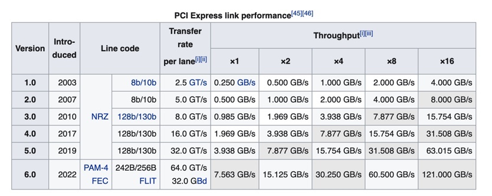
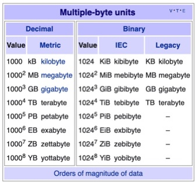

# PCIe bandwidth calculation 

In computer technology, **transfers per second** and its more common secondary terms **gigatransfers per second** (abbreviated as **GT/s**) and **megatransfers per second** (**MT/s**) are informal language that refer to the number of operations transferring data that occur in each second in some given [data-transfer channel](https://en.wikipedia.org/wiki/Communications_channel). 

For example, a data bus **eight-bytes wide (64 bits)** by definition transfers eight bytes in each transfer operation; **at a transfer rate of 1 GT/s** (this is defined by clock), the data rate would be 8 × 10^9 B/s, i.e. 8 GB/s, or approximately 7.45 GiB/s. The [bit rate](https://en.wikipedia.org/wiki/Bit_rate) for this example is 64 Gbit/s (8 × 8 × 10^9 bit/s).

PCIe terminology, transfer rate refers to the encoded bit rate: **2.5 GT/s is 2.5 Gbps** on the encoded serial link. This corresponds to **2.0 Gbps of pre-coded data** or **250 MB/s**, which is referred to as throughput in PCIe.

Metrics Unit

